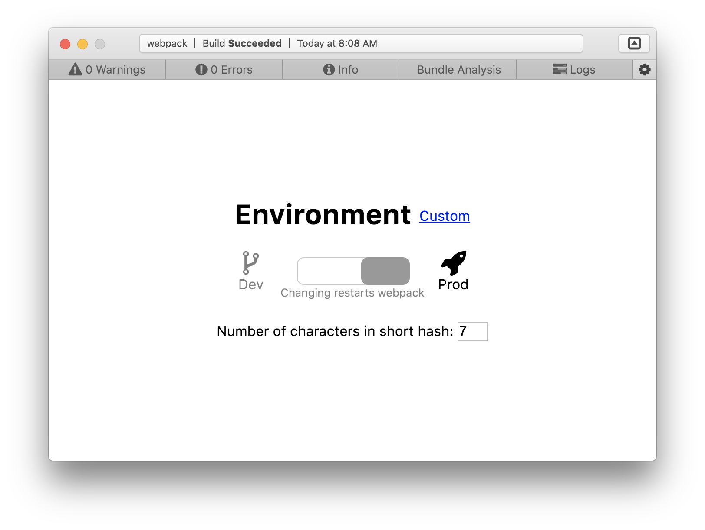

# build-it

> Build your apps, with a GUI

## Screenshots
  
  
Clicking the down arrow reveals this:  
  
The modules section expands:  
  
There are settings, although they’re not that complicated right now:  

build-it also keeps every message logged during the build:

